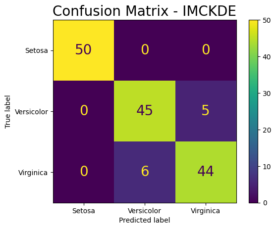
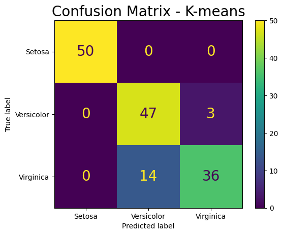

# README - IMCKDE Algorithm

The purpose of this notebook is to provide a step-by-step tutorial of how the new proposed clustering algorithm can be used.

As an example, we will perform clustering on the Iris dataset.

Start by installing the requirements.


```python
!pip install -r requirements.txt
```

Import Libraries


```python
from IMCKDE_algorithm import IMCKDE
from sklearn import datasets
from sklearn.metrics import silhouette_score
```

Loading the Iris dataset.


```python
iris = datasets.load_iris()
```

The IMCKDE class takes the following parameters:

Parameters:  

        dataset (array-like): Data points.  
        n_clusters (int): Number of clusters. Optional.
        alpha (float): Smoothing parameter.  
        beta (float): Threshold multiplier.  
        adam (bool): Whether to use ADAM optimizer.

So let's predict the results for the Iris dataset and display the  
clustering centroids and the points classification.


```python
imkde = IMCKDE(dataset = iris.data, alpha = 2.1, beta = 3, n_clusters = 3).predict()

import pprint

print(f"\033[1m Clustering centroids: \033[0m {imkde.centroids()}")
print()
print(f" Clustering points classification: \033[0m {imkde.clusters()}")
```

    Clustering centroids: [array([5.02, 3.41, 1.48, 0.25]), array([5.74, 2.82, 4.19, 1.29]), array([6.63, 3.08, 5.51, 2.15])]
    
    Clustering points classification: [0 0 0 0 0 0 0 0 0 0 0 0 0 0 0 0 0 0 0 0 0 0 0 0 0 0 0 0 0 0 0 0 0 0 0 0 0
     0 0 0 0 0 0 0 0 0 0 0 0 0 2 1 2 1 1 1 1 1 1 1 1 1 1 1 1 1 1 1 1 1 1 1 1 1
     1 1 2 2 1 1 1 1 1 1 1 1 2 1 1 1 1 1 1 1 1 1 1 1 1 1 2 2 2 2 2 2 1 2 2 2 2
     2 2 1 2 2 2 2 2 1 2 1 2 2 2 2 1 2 2 2 2 2 2 2 2 2 2 2 1 2 2 2 2 2 2 2 2 2
     2 2]


Calculating the Silhouette Coefficient:


```python
silhouette = imkde.metrics_calculation("silhouette", iris.target)

print(f'Silhouette Coefficient for the Iris dataset: {silhouette:.3f}')
```

    Silhouette Coefficient for the Iris dataset: 0.528


Since we have the original labels, let's calculate the precision and plot   
the confusion matrix:


```python
precision = imkde.metrics_calculation("precision", iris.target)

print(f'Precision for the Iris dataset: {precision:.3f}')
```

    Precision for the Iris dataset: 0.927


```python
from utils import plot_confusion_matrix
y_true = iris.target

y_pred = imkde.output_array
labels = ['Setosa', 'Versicolor', 'Virginica']
plot_confusion_matrix(y_true, y_pred, labels = labels, filename = '.\iris_imkde.jpeg', title = 'Confusion Matrix - IMCKDE')
```


    

    


## Comparison with K-means

Let's perform the same calculations with k-means and compare it to IMCKDE.


```python
from sklearn.datasets import load_iris
from sklearn.cluster import KMeans
from assignment_problem import ClusterMapper
from sklearn.metrics import precision_score

iris = load_iris()
target = iris.target
n_clusters = 3
dataset = iris.data
kmeans = KMeans(n_clusters=3, random_state=0, n_init='auto').fit(iris.data)
result = (kmeans.labels_, kmeans.cluster_centers_,)
mapper = ClusterMapper(n_clusters)
maps = mapper.mapping__clusters(target, dataset, result)

precision = precision_score(target, maps, average='weighted')
silhouette = silhouette_score(dataset, kmeans.labels_)

print(f'Precision Score for k-means: {precision}')
print(f'Silhouette Coefficient for k-means: {silhouette}')
```

    Precision Score for k-means: 0.8978562421185372
    Silhouette Coefficient for k-means: 0.551191604619592


* **Conclusion**:

    The IMCKDE has a lower Silhouette Coefficient but a higher precision in the Iris dataset   
    when compared to the k-means.

    Below the confusion matrix is displayed for the k-means.


```python
from utils import plot_confusion_matrix
y_true = iris.target
y_pred = maps
labels = ['Setosa', 'Versicolor', 'Virginica']
plot_confusion_matrix(y_true, y_pred, labels = labels, filename = '.\iris_kmeans.jpeg', title = 'Confusion Matrix - K-means')
```


    

    

